Media and Modern Apps cloud hackathon
=====================================

Overview
--------

The goal of this hackathon is to build a moderation workflow for media
User-Generated Content (UGC). The first task will involve deploying and
configuring a ready-made workflow to detect some new content, encode it and
provide a preview to the moderator. You will then need to extend this workflow
with two new workflows: one to approve the content, and another one to reject
it. Each new workflow will highlight specific functionalities and advantages of
the Azure Media Services and Serverless services.

Requirements
------------

-   Local machine or a virtual machine configured with:

    -   [Git](https://git-scm.com/downloads)

    -   [Node.js](https://nodejs.org/en/download/)

    -   IDE ([Visual Studio Code](https://code.visualstudio.com/) or other)

    -   [Azure Media Services Explorer](http://aka.ms/amse)

    -   [Postman](https://www.getpostman.com/)

-   Your own [GitHub](https://github.com) account (you will need this account to
    fork the original workflow)

-   Your own Dropbox, GDrive or OneDrive folder.

-   An Outlook.com or Gmail account.

-   A [bitlink](https://www.bitly.com) account.

**Read Before Continuing**
--------------------------

To complete this lab, you must have full global contributor access to your Azure
subscription. This lab requires that you can create different types of services
such as DocumentDB, Functions and Logic Apps.

If you do not have permissions you will not be able to complete this lab using
your current subscription.

Lab structure
-------------

This lab has two sets of instructions. The first is a high-level set of
instructions that is designed for attendees with previous experience in Logic
Apps, Azure Functions, and continuous integration in Azure App Services. The
second set of instructions provide detailed step-by-step instructions for each
lab task.

Exercise 1: Environment setup
-----------------------------

In this exercise, you will set up your environment for use for the rest of the
exercises. This exercise will involve creating a virtual machine with the
correct tools in place.

### Task 1: Setup a development environment

If you do not have a machine setup with Visual Studio 2015 Community Update 3
and Azure SDK 2.9.+, complete this task.

1.  Create a virtual machine in Azure using the Visual Studio Community 2015
    Update 3 and SDK 2.9.+ on Windows Server 2012 R2 image.

    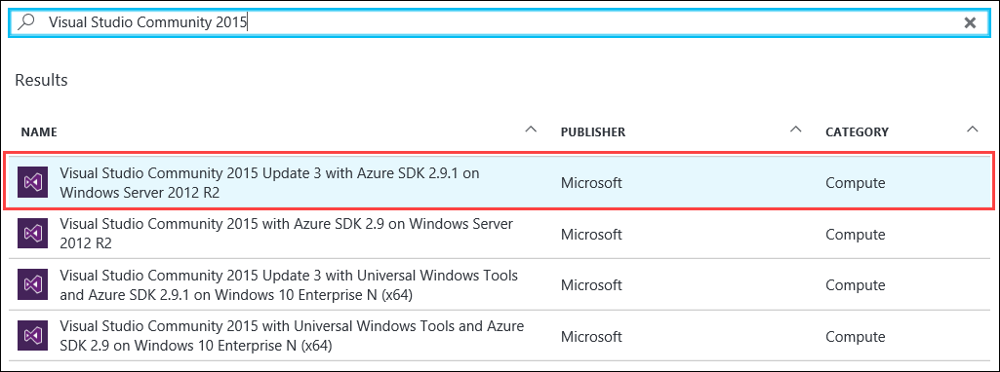

Figure 1: Setting up a Virtual Machine in the Azure Portal

We *highly* recommended using a DS2 or D2 instance size for this virtual machine
(VM).

### Task 2: Install all required software

Whether you are using your own local machine or the Virtual Machine previously
installed, you should install the following pieces of software:

-   [Git](https://git-scm.com/downloads)

-   [Node.js](https://nodejs.org/en/download/)

-   IDE ([Visual Studio Code](https://code.visualstudio.com/) or other). If you
    are relying on the VM, it already contains Visual Studio that you will be
    able to use as an IDE.

-   [Azure Media Services
    Explorer](https://github.com/Azure/Azure-Media-Services-Explorer/releases)

-   [Postman](https://www.getpostman.com/)

Exercise 2: Deploy the VOD complex workflow
-------------------------------------------

In this exercise, you will deploy, configure and test a pre-built VOD workflow
based on Azure Logic Apps and Azure Functions. This workflow detects when a file
is added in a specific OneDrive folder, and triggers the encoding and the
publishing of the asset. Last, it sends an e-mail with a thumbnail and some
links to playback the content and download the subtitles.

Once deployed and tested, this workflow will serve as your reference.

#### Tasks to complete

-   Go to <http://aka.ms/amsfunctions> (redirected to
    <https://github.com/Azure-Samples/media-services-dotnet-functions-integration>)
    and fork the project to your own GitHub account.

-   From your GitHub account, deploy the azuredeploy.json template into your
    Resource Group. Choose “media-functions-for-logic-app” as a project.

-   After the functions have been deployed, move to the
    “media-functions-for-logic-app” folder, and deploy
    “logicapp2-advancedvod-deploy.json” in the same Resource Group.

-   Edit the Logic App and fix the connection issues.

-   Test end-to-end workflow.

#### Exit criteria 

-   End-to-end workflow is functional.

Exercise 3: Modify the VOD workflow for moderation
--------------------------------------------------

A User-Generated Content is typically composed of two separate workflows. The
first one is very similar to the previous workflow, and provides the means to
the moderator to verify the integrity of the content. The second part of the
workflow depends on the approval or rejection of the content, with different
actions being triggered depending on the moderator decision.

### Help references

| DocumentDB                                | https://docs.microsoft.com/en-us/azure/documentdb/                                     |
|-------------------------------------------|----------------------------------------------------------------------------------------|
| Continuous Deployment for Azure Functions | https://docs.microsoft.com/en-us/azure/azure-functions/functions-continuous-deployment |

### Task 1: Modify the encoding process to generate one single bitrate

In this exercise, you will instruct the Azure Media Encoder Standard to read a
custom preset containing a single bitrate video stream, a single audio and a
thumbnail

#### Tasks to complete

-   Clone the original VOD workflow in the same Resource Group.

-   Disable the original VOD workflow (so that it stops monitoring the OneDrive
    folder).

-   Create a new preset on your local Git repository, and deploy it to Azure.

-   Modify Media Encoder Standard to use your new preset.

#### Exit criteria 

-   Original workflow has been cloned and disabled.

-   Verify that your workflow still works end-to-end. Playback in Azure Media
    Player should show only one single bitrate.

### Task 2: Create a DocumentDB database

In this exercise, you will modify your original VOD workflow to record the
characteristics of the asset. For that purpose, we will rely on DocumentDB
(NoSQL) which provides an easy way to record JSON structures.

#### Tasks to complete

-   Deploy an instance of Azure DocumentDB. Create a Database called “Media” and
    a Collection named “Assets”.

-   Before the e-mail stage, add a record in DocumentDB including the following
    data:

    -   Original Asset ID: you can use this assetId as the “id” key.

    -   multibitrateAssetId: which will remain empty here.

    -   previewAssetId: the result of the single bitrate encoding.

    -   Status: mark it as “forReview”.

    -   subtitlesAssetId

    -   subtitles\_en\_url

    -   subtitles\_fr\_url

#### Exit criteria 

-   Test again the end-to-end workflow and verify that a record is indeed added
    to DocumentDB.

### Task 3: Send an e-mail to the moderator

In this exercise, you will modify the e-mail being sent at the end of the
workflow to include two hyperlinks:

-   1st hyperlink: to approve the asset and trigger a multibitrate encoding.

-   2nd hyperlink: to reject the asset and clean up the database and storage.

#### Tasks to complete

-   Modify the e-mail to add the two hyperlinks. The URLs should implement the
    following syntax:

    -   Approve:
        [http://localhost:3000/approve?assetID=\<your\_asset\_ID](http://localhost:3000/approve?assetID=%3cyour_asset_ID)\>

    -   Reject:
        [http://localhost:3000/reject?assetID=\<your\_asset\_ID](http://localhost:3000/reject?assetID=%3cyour_asset_ID)\>

-   Add to the e-mail the assetID of the asset before encoding. You will need
    this string for the next exercises.

#### Exit criteria 

-   Verify that your e-mail calls the correct URLs.

Congratulations, you now have completed the first part of the moderator
workflow!

Exercise 4: Create a Logic App to approve the asset
---------------------------------------------------

In this exercise, you will create your own Logic App to re-encode the asset in
multiple bitrates. Because the subtitles have already been generated, it won’t
be necessary to call the indexer. Rather, we will use the Logic App to link the
existing subtitles to the new multi-bitrate asset.

### Help references

| Logic Apps Workflow Definition Language                       | https://docs.microsoft.com/en-us/azure/logic-apps/logic-apps-workflow-definition-language |
|---------------------------------------------------------------|-------------------------------------------------------------------------------------------|
| Logic Apps Workflow actions and triggers for Azure Logic Apps | https://docs.microsoft.com/en-us/azure/logic-apps/logic-apps-workflow-actions-triggers    |
| Handle content types in Logic Apps                            | https://docs.microsoft.com/en-us/azure/logic-apps/logic-apps-content-type                 |

### Task 1: Create a new Logic App as a callable HTTP endpoint

In this task, you will create a new Logic App, and your first trigger will be a
HTTP request. This logic app will later be called by a small web server
application running on your localhost, when the moderator clicks on “Approve” in
the e-mail previously generated.

#### Tasks to complete

-   Create a new Logic App in the same Resource Group.

-   Create a new trigger “HTTP Request”.

-   Add a JSON schema to reflect the following JSON structure:

    {

    “id”: “abc”

    }

-   Save Logic App to obtain the URL to trigger it.

#### Exit criteria 

-   Using Postman, trigger the Logic App with the assetID listed in the e-mail
    previously generated. Verify the response code.

-   In the Azure portal, verify that the Logic App has been triggered.

### Task 2: Re-encode the asset using a multi-bitrate preset

In this task, you will re-create a publishing workflow by re-using most of the
steps previously implemented in the original VOD workflow. The aim of this
exercise is to familiarize yourself with the Workflow Definition Language of
Logic Apps, and see how JSON structures can be easily parsed.

#### Tasks to complete

-   Recreate encoding workflow based on the assetID passed in the HTTP request.

-   Retrieve the record in documentDB corresponding to the original assetID.

-   Create a bitlink including the new PlayerURL and the previously generated
    subtitles URLs.

-   Update the status of the asset in DocumentDB to “published”.

-   Send a confirmation e-mail with the new bitlink.

#### Exit criteria 

-   Using Postman, trigger the Logic App with the assetId listed in the e-mail
    previously generated. Verify that the end-to-end workflow generates a new
    asset.

-   Playback the new multi-bitrate asset in Azure Media Player, and verify that
    it includes multiple bitrates.

-   Verify that the status of the asset in DocumentDB is indeed marked as
    “published”.

### Task 3: Verify the end-to-end approval workflow

In this task, you will configure a local web server application to relay the
moderation request to the Logic App you have just created. This server
application will listen on port 3000 for two types of requests:

-   [http://localhost:3000/approve?assetId=\<your\_asset\_ID](http://localhost:3000/approve?assetId=%3cyour_asset_ID)\>

-   [http://localhost:3000/reject?assetId=\<your\_asset\_ID](http://localhost:3000/reject?assetId=%3cyour_asset_ID)\>

#### Tasks to complete

-   Clone and install the
    [media-moderator](https://github.com/npintaux/media-moderator) web server
    application (Node.js) to your development machine.

-   Configure the config.json file with the URL of your “approval” Logic App.

-   Run the media-moderator server, and verify the end-to-end workflow.

#### Exit criteria 

-   When clicking on the “Approve” hyperlink, the media-moderator web server
    should trigger the Logic App.

Exercise 5: Implement the “Reject” workflow
-------------------------------------------

Following the same principles used in Exercise 3, you will now create a new
Logic App to reject the asset. This Logic App will be triggered by an HTTP
request from the media-moderator web server application, and will remove all
assets from storage and delete the record in DocumentDB.

### Task 1: Create a new Logic App as a callable HTTP endpoint

In this task, you will create a new Logic App, and your first trigger will be a
HTTP request. This logic app will later be called by a small web server
application running on your localhost, when the moderator clicks on “Reject” in
the e-mail previously generated.

#### Tasks to complete

-   Create a new Logic App in the same Resource Group.

-   Create a new trigger “HTTP Request”.

-   Add a JSON schema to reflect the following JSON structure:

    {

    “id”: “abc”

    }

-   Save Logic App to obtain the URL to trigger it.

-   Update the URL in the media-moderator web server application config file,
    and verify end-to-end workflow.

#### Exit criteria 

-   Using Postman, trigger the Logic App with the assetID listed in the e-mail
    previously generated. Verify the response code.

-   In the Azure portal, verify that the Logic App has been triggered.

### Task 2: Clean-up task

In this task, you will first retrieve all the assetIDs from DocumentDB for the
assetID passed in the request. You will then delete the record in DocumentDB.

#### Tasks to complete

-   Retrieve record for the assetID in DocumentDB.

-   Parse the JSON structure.

-   Use the JSON-parsed assetIDs to delete the assets using the Azure Media
    Services Functions.

#### Exit criteria 

-   Verify end-to-end workflow.

-   Using Azure Media Services Explorer, verify that all assets have been
    correctly deleted.

-   Verify that DocumentDB no longer contains a document for your assetID.

Exercise 6: Environment Clean-up
--------------------------------

In order to avoid charges, please delete the Resource Group into which you
deployed all your resources.

Media and Modern Apps cloud hackathon answers
=============================================

Overview
--------

The goal of this hackathon is to build a moderation workflow for media
User-Generated Content (UGC). The first task will involve deploying and
configuring a ready-made workflow to detect some new content, encode it and
provide a preview to the moderator. You will then need to extend this workflow
with two new workflows: one to approve the content, and another one to reject
it. Each new workflow will highlight specific functionalities and advantages of
the Azure Media Services and Serverless services.

Requirements
------------

-   Local machine or a virtual machine configured with:

    -   [Git](https://git-scm.com/downloads)

    -   [Node.js](https://nodejs.org/en/download/)

    -   IDE ([Visual Studio Code](https://code.visualstudio.com/) or other)

    -   [Azure Media Services
        Explorer](https://github.com/Azure/Azure-Media-Services-Explorer/releases)

    -   [Postman](https://www.getpostman.com/)

-   Your own [GitHub](https://github.com) account (you will need this account to
    fork the original workflow)

-   Your own Dropbox, GDrive or OneDrive folder.

-   An Outlook.com or Gmail account.

-   A [bitlink](https://www.bitly.com) account.

**Read Before Continuing**
--------------------------

To complete this lab, you must have full global contributor access to your Azure
subscription. This lab requires that you can create different types of services
such as DocumentDB, Functions and Logic Apps.

If you do not have permissions you will not be able to complete this lab using
your current subscription.

Lab structure
-------------

This lab has two sets of instructions. The first is a high-level set of
instructions that is designed for attendees with previous experience in Logic
Apps, Azure Functions, and continuous integration in Azure App Services. The
second set of instructions provide detailed step-by-step instructions for each
lab task.

Exercise 1: Environment setup
-----------------------------

In this exercise, you will set up your environment for use for the rest of the
exercises. This exercise will involve creating a virtual machine with the
correct tools in place.

### Task 1: Setup a development environment

If you do not have a machine setup with Visual Studio 2015 Community Update 3
and Azure SDK 2.9.+, complete this task.

1.  Create a virtual machine in Azure using the Visual Studio Community 2015
    Update 3 and SDK 2.9.+ on Windows Server 2012 R2 image.

    

Figure 2: setting up a Virtual Machine in the Azure Portal

We *highly* recommended using a DS2 or D2 instance size for this virtual machine
(VM).

### Task 2: Install all required software

Whether you are using your own local machine or the Virtual Machine previously
installed, you should install the following pieces of software:

-   [Git](https://git-scm.com/downloads)

-   [Node.js](https://nodejs.org/en/download/)

-   IDE ([Visual Studio Code](https://code.visualstudio.com/) or other). If you
    are relying on the VM, it already contains Visual Studio that you will be
    able to use as an IDE.

-   [Azure Media Services Explorer](http://aka.ms/amse)

-   [Postman](https://www.getpostman.com/)

Exercise 2: Deploy the VOD complex workflow
-------------------------------------------

In this exercise, you will deploy, configure and test a pre-built VOD workflow
based on Azure Logic Apps and Azure Functions. This workflow detects when a file
is added in a specific OneDrive folder, and triggers the encoding and the
publishing of the asset. Last, it sends an e-mail with a thumbnail and some
links to playback the content and download the subtitles.

Once deployed and tested, this workflow will serve as your reference.

1.  Go to <http://aka.ms/amsfunctions> (redirected to
    <https://github.com/Azure-Samples/media-services-dotnet-functions-integration>)
    and fork the project to your own GitHub account (Figure 3).

    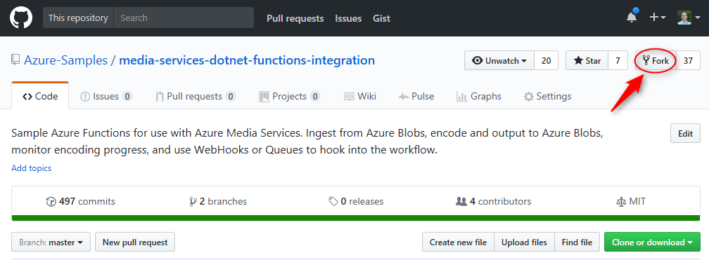

Figure 3: Forking the Azure-Samples/media-services-dotnet-functions-integration
project

1.  Optional but needed if you want to edit the functions later or access the
    templates from your disk: clone the forked project in your local git
    repository.

2.  Deploy the Azure functions for Media Services template.

    a.  Option 1 : In GitHub, on your fork, go to the
        *media-functions-for-logic-app* folder and click on the first “Deploy to
        Azure” button to deploy the functions (Figure 4).  
          
        (Please note that this button deploys the ARM template which is in the
        public repo, not the one in your fork (file
        <https://github.com/Azure-Samples/media-services-dotnet-functions-integration/blob/master/azuredeploy.json>).
        This is not a problem as they are identical. If you edit the ARM
        template and want to deploy this new version, then you need to edit the
        link in README.md).  
          
        

        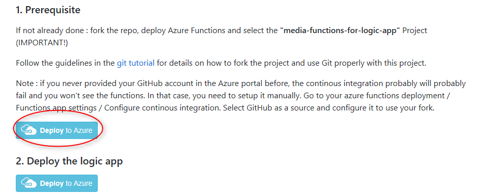

Figure : Deploy to Azure button

b.  Option 2: In Azure Portal, type “deploy” in the search bar, and select
    “Deploy a custom template” (Figure 5).  
      
    

    

Figure 5: Finding the template deployment option

Click on “Edit” and “Load File”. Select the azuredeploy.json file at the root of
the “media-services-dotnet-functions-integrations” repository (Figure 6).  
  

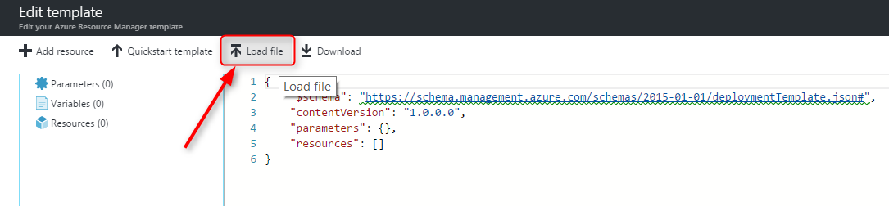

Figure 6: Loading a custom deployment template

Click Save.

1.  This opens up a deployment template. Create a new or use an existing
    Resource Group. This name will be important for the next deployment. Select
    the appropriate region, and provide a “Functions App Name”, which you will
    need to reuse as well later.

    Select “media-functions-for-logic-app” as your project.

    Important: set your forked GitHub repository for the source code repository
    URL.

    After approving the Terms and Conditions, click on “Purchase”.

    The deployment process should take between 5 and 10 minutes.

    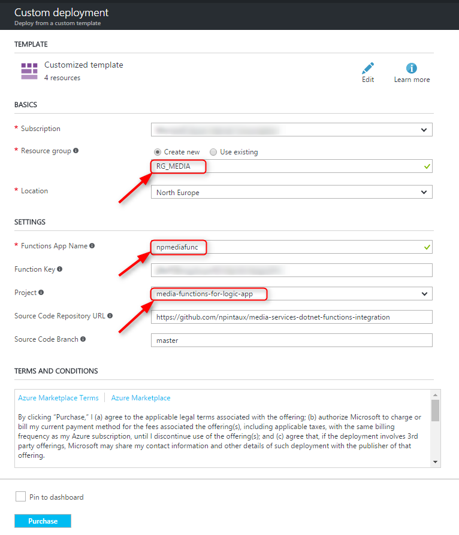

Figure : Custom template deployment

1.  Once the template is deployed, you can then deploy the other template for
    the VOD complex Logic App. In the README in the
    “media-functions-for-logic-app” folder, there is a section “Second logic app
    : an advanced VOD workflow”. **Do make sure to use the same name for the
    Functions App Name and the same Resource Group.**  
      
    (Please note that this button deploys the ARM template which is in the
    public repo, not the one in your fork (file
    <https://github.com/Azure-Samples/media-services-dotnet-functions-integration/blob/master/media-functions-for-logic-app/logicapp2-advancedvod-deploy.json>).
    This is not a problem as they are identical. If you edit the ARM template
    and want to deploy this new version, then you need to edit the link in
    README.md).  
      
      
    

    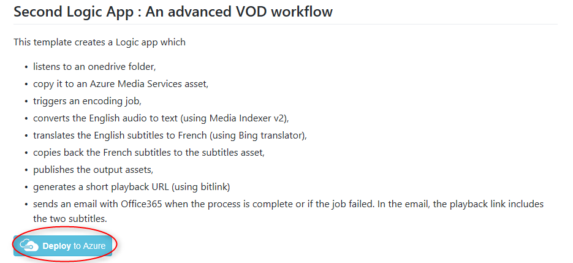

Figure : Deploy the advanced logic app

1.  Once the second template is deployed, edit the Logic App et fix the
    connections for OneDrive, Bitlink and Gmail. Make sure to (re)select the
    OneDrive folder.

2.  To speed the processing, using Azure Media Services Explorer, allocate one
    S3 encoding unit to your instance of Azure Media Services (“Jobs” tab). See
    Figure 7.

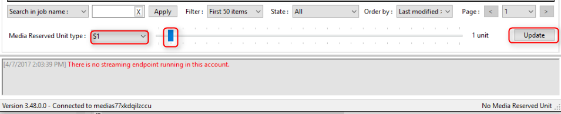

Figure : selecting the number and type of Reserved Units

1.  Within Azure Media Services Explorer, start the default steaming endpoint in
    order to enable streaming.

2.  Drop a file in your OneDrive folder, and verify that the Logic App gets
    triggered. Observe the processes being triggered one by one in the workflow.

3.  Once you have received the e-mail (Figure 8), playback the content.

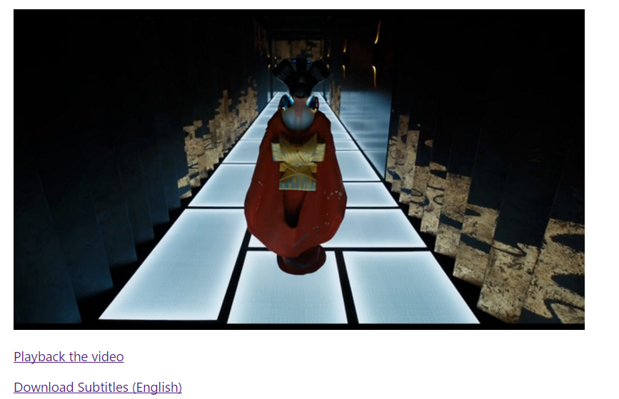

Figure 11: Example of e-mail containing a thumbnail and links

Exercise 3: Modify the VOD workflow for moderation
--------------------------------------------------

A User-Generated Content is typically composed of two separate workflows. The
first one is very similar to the previous workflow, and provides the means to
the moderator to verify the integrity of the content. The second part of the
workflow depends on the approval or rejection of the content, with different
actions being triggered depending on the moderator decision.

### Help references

| DocumentDB                                | https://docs.microsoft.com/en-us/azure/documentdb/                                     |
|-------------------------------------------|----------------------------------------------------------------------------------------|
| Continuous Deployment for Azure Functions | https://docs.microsoft.com/en-us/azure/azure-functions/functions-continuous-deployment |

### Task 1: Modify the encoding process to generate one single bitrate

In this exercise, you will instruct the Azure Media Encoder Standard to read a
custom preset containing a single bitrate video stream, a single audio and a
thumbnail.

1.  Clone the original VOD workflow for reference in the same Resource Group,
    and disable it (Figure 9).

    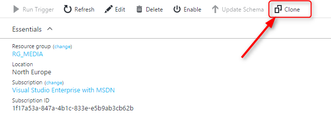

Figure 12: Cloning and disabling a Logic App

1.  Edit your Logic App, et select the “submit-job” stage. As described in
    Figure 10, the preset used by the encoder is provided as a local json file.
    Update the name of this file to reflect that it will be a Single Bitrate
    encoding preset.

    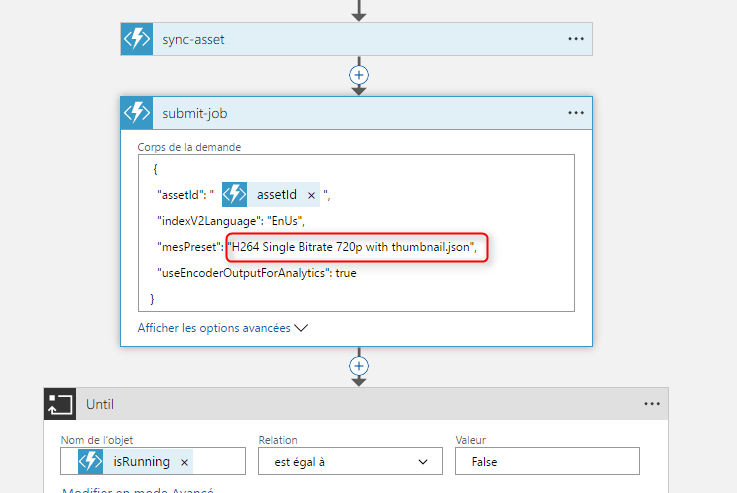

Figure 13: MES encoding preset preferences

1.  We will now create this preset.

    1.  Go to the
        \~\\media-functions\\media-services-dotnet-functions-integration\\media-functions-for-logic-app\\presets
        folder, and copy the “H264 Multiple Bitrate 720p with thumbnail.json”
        file into a new file named “H264 Single Bitrate 720p with
        thumbnail.json”.

    2.  Open the “H264 Single Bitrate 720p with thumbnail.json” file and delete
        all profiles except the highest quality one. Save your file.

    3.  Commit the file to your local Git repository and push it to your GitHub
        repo.

>   Because Azure Functions support Continuous Deployment, the new file will be
>   uploaded to your Azure deployment automatically. The Azure Media Encoder
>   Standard will then be able to reference it.

1.  Test the end-to-end workflow. Verify that the playback contains only one
    profile.

### Task 2: Create a DocumentDB database

In this exercise, you will modify your original VOD workflow to record the
characteristics of the asset. For that purpose, we will rely on DocumentDB
(NoSQL) which provides an easy way to record JSON structures.

1.  In the Azure Portal search bar (Figure 11), type “DocumentDB”, and select
    “NoSQL (Document DB).

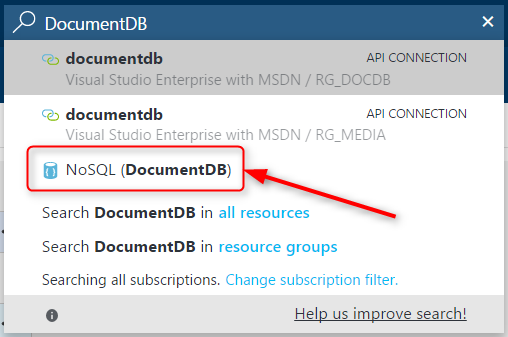

Figure 14: Locating the DocumentDB instances in the Azure Portal

1.  Make sure to deploy the instance in the same ResourceGroup, and to pick the
    type “DocumentDB” (Figure 12).

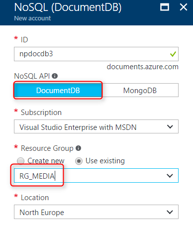

Figure 15: initialization of the DocumentDB instance

1.  Once the instance is deployed, click on “Add Collection…” (Figure 13):

>   [./media/image15.png](./media/image15.png)

Figure 16: adding a Collection to the DocumentDB instance

>   On the next screen, set the Collection Id to “Assets”, select the 10 GB
>   Storage capacity, and set the Database name to “Media” (Figure 14). You will
>   use these resource names when setting up the DocumentDB connector.

>   [./media/image16.png](./media/image16.png)

Figure 17: Initialization of the Collection

1.  Edit the Logic App, and click on the “+” sign (overlay your mouse on top of
    the link) between the Bitlink connector and the E-mail connector at the
    bottom. Select “Add Action” (Figure 15).

    

Figure 18: Adding an action to the Logic App

In the “Choose Action” dialog, type “DocumentDB” in the search bar, and select
“Create or Update Document” (Figure 16).

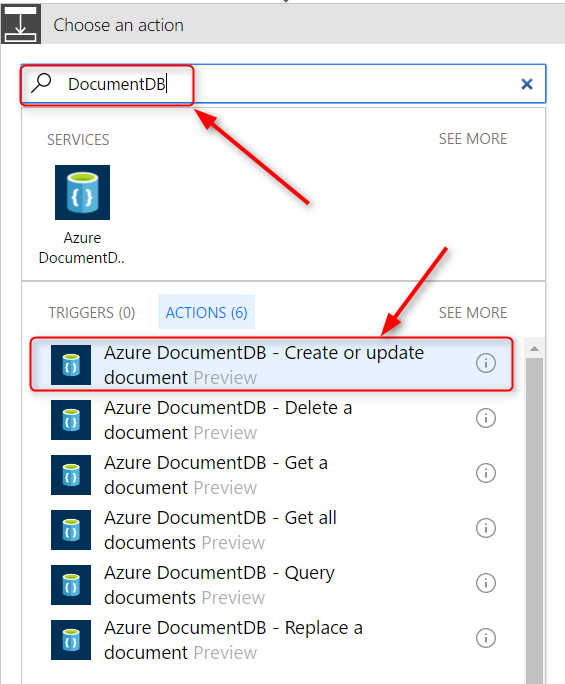

Figure 19: Adding a document to DocumentDB

**Type** the name of the instance in the “Connection Name” field (Figure 17).

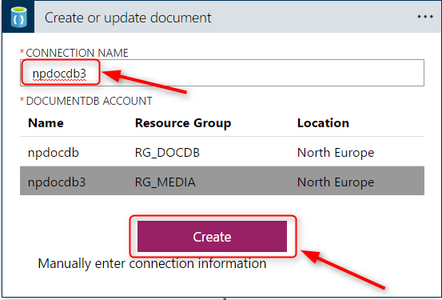

Figure 20: selecting the correct instance of DocumentDB

You will then need to select the names of the database and the collections, and
enter a JSON structure as a new Document. The JSON structure should look like
this:

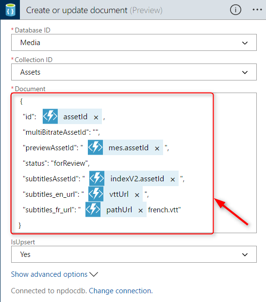

Figure 21: JSON structure to enter in the DocumentDB connector

To do so, you can switch to the “Code View” of the Logic App, and locate the
“input” parameters of the DocumentDB connector by its name, and copy the
following structure:

"body": {

"id": "\@body('create-empty-asset')['assetId']",

"multiBitrateAssetId": "",

"previewAssetId":"\@{body('submit-job')['mes']['assetId']}",

"status": "forReview",

"subtitlesAssetId": "\@{body('submit-job')['indexV2']['assetId']}",

"subtitles\_en\_url": "\@{body('return-subtitles')['vttUrl']}",

"subtitles\_fr\_url":"\@{body('publish-subtitles-asset')['pathUrl']}french.vtt"

}

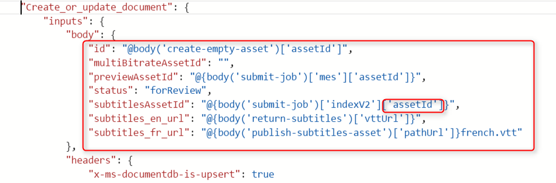

**Explanation:**

Switching back to the designer view, let’s try to select the original assetId as
the “id” of the document. In the designer view, when starting to write the JSON
structure, we would be shown the following screen: on the right end side, we can
select from a list of fields output from each previous steps in the Logic App.
Yet, we can only select the “Body” item of the “create-empty-asset” function
(Figure 19).

Switching then to the “Code” view, we can see the following:

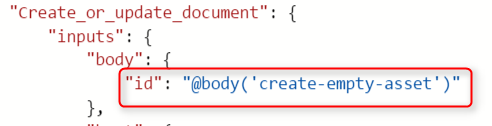

In order to retrieve the assetID, we therefore need to reference the sub-object
assetID in the body of the returned body (Figure 20).

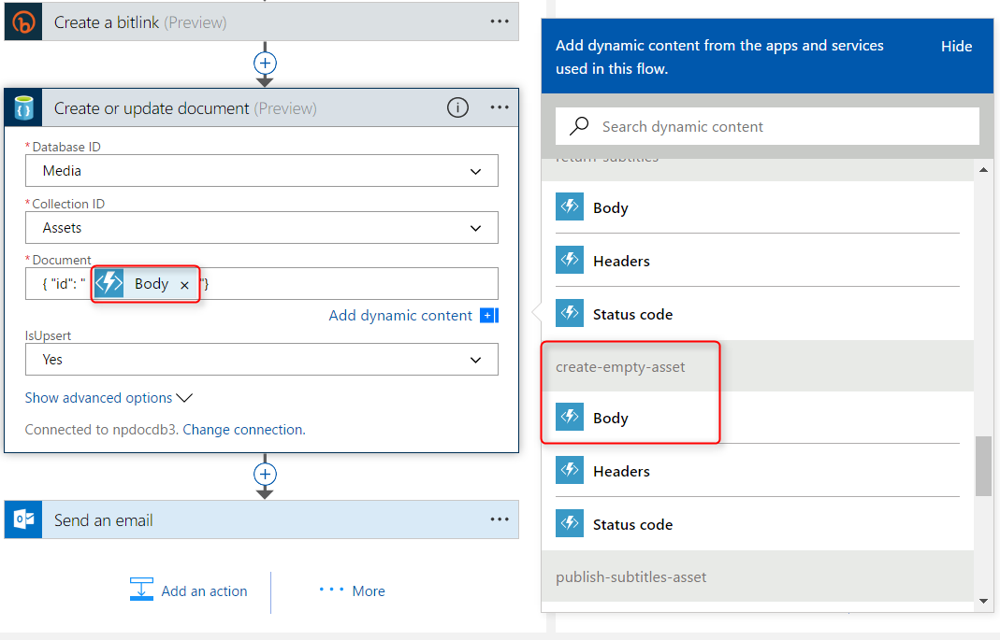

Figure 22: Selecting the correct "Body" for the JSON item

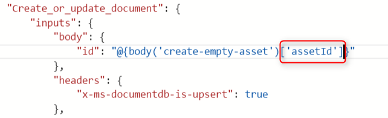

Figure 23: Referencing the "assetID" field in the Body

After saving the Logic App and returning to the Design view, we can see the
assetId being reported (Figure 21). We need to do the same for all fields of the
Document, picking the right “body” fields from the different stages in order to
extract the correct information from them.

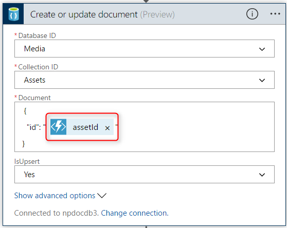

Figure 24: AssetId field being referenced properly

1.  Once this step is complete, we can once again run the end-to-end flow and
    verify that the asset is correctly set “for review” in DocumentDB. To do so,
    edit the DocumentDB resource, and select “Document Explorer” (under
    Collections in the documentDB menu) - Figure 22

>   [./media/image26.png](./media/image26.png)

Figure 25: Finding documents in DocumentDB

1.  To finish this exercise, we will modify the body of the e-mail to include
    two links to Approve or Reject the asset.

    In the code view of the Logic App, you will therefore modify the body of the
    e-mail to include those links, in which the assetID of the
    “create-empty-asset” stage is passed. For practical purposes, we are also
    writing the assetId in the body itself.

    \<html\>

    \<body\>

    \<strong\>There is a new video encoded ready for your approval\</strong\>

    \<p\>\<a href=\\"\@{body('Create\_a\_bitlink')['url']}\\"\>\\</p\>

    \<p\>\<a href=\\"\@{body('Create\_a\_bitlink')['url']}\\"\>Playback the
    video\</a\>\</p\>\<p\>\<a
    href=\\"\@{body('return-subtitles')['vttUrl']}\\"\>Download Subtitles
    (English)\</a\>\</p\>

    \<p\>ID of the asset to approve:
    \\"\@{body('create-empty-asset')['assetId']}\\"\</p\>

    \<p\>\<a
    href=\\"http://localhost:3000/approve?assetId=\@{body('create-empty-asset')['assetId']}\\"\>Approve\</a\>\<p/\>

    \<p\>\<a
    href=\\"http://localhost:3000/reject?assetId=\@{body('create-empty-asset')['assetId']}\\"\>Reject\</a\>\</p\>

    \</body\>

    \</html\>

Exercise 4: Create a Logic App to approve the asset
---------------------------------------------------

In this exercise, you will create your own Logic App to re-encode the asset in
multiple bitrates. Because the subtitles have already been generated, it won’t
be necessary to call the indexer. Rather, we will use the Logic App to link the
existing subtitles to the new multi-bitrate asset.

### Help references

| Logic Apps Workflow Definition Language                       | https://docs.microsoft.com/en-us/azure/logic-apps/logic-apps-workflow-definition-language |
|---------------------------------------------------------------|-------------------------------------------------------------------------------------------|
| Logic Apps Workflow actions and triggers for Azure Logic Apps | https://docs.microsoft.com/en-us/azure/logic-apps/logic-apps-workflow-actions-triggers    |
| Handle content types in Logic Apps                            | https://docs.microsoft.com/en-us/azure/logic-apps/logic-apps-content-type                 |

### Task 1: Create a new Logic App as a callable HTTP endpoint

In this task, you will create a new Logic App, and your first trigger will be a
HTTP request. This logic app will later be called by a small web server
application running on your localhost, when the moderator clicks on “Approve” in
the e-mail previously generated.

1.  From the Azure Portal, create a new Logic App, and place it into the same
    Resource Group as the other resources.

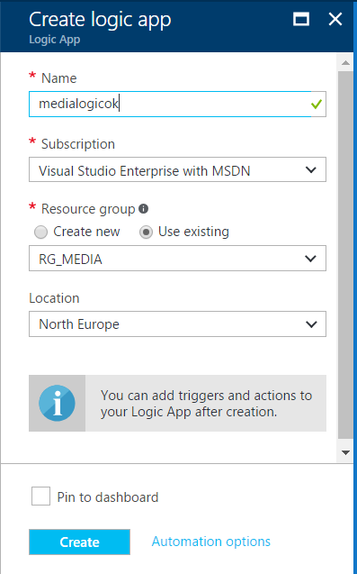

Figure 26: Creating a Logic App

1.  In the “Start with a common trigger”, select “When a HTTP request is
    received”.

    

2.  Save immediately the Logic App to see the URL to trigger this Logic App.

    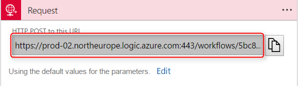

Figure 27: URL to trigger the Logic App

1.  We will now edit the Logic App so that it handles a specific body syntax.
    Click on “Edit”, and then “Use sample payload to generate schema” (Figure
    25).

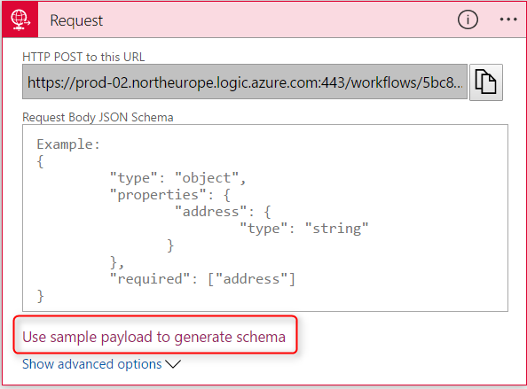

Figure 28: Defining a schema for the body of the HTTP request

In the textbox, enter the following JSON structure, and click OK:

>   { “id”: “abc” }

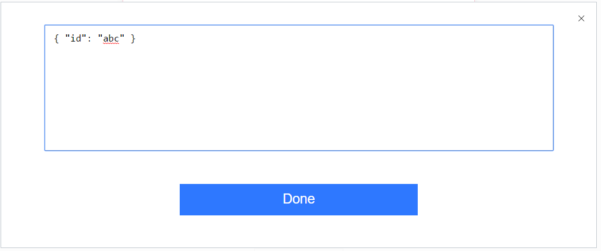

This will automatically generate a schema (Figure 26).

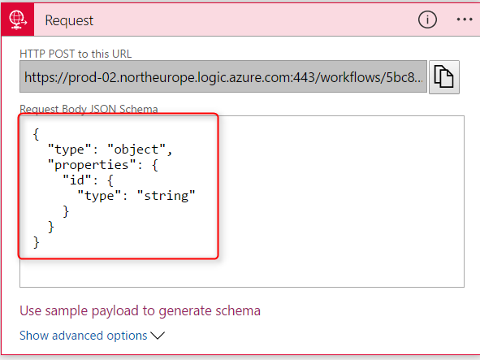

Figure 29: Automated schema generation

Save the Logic App, et verify with Postman that you can trigger it. You can also
check in the Azure portal that the trigger was successful.

1.  Add a DocumentDB connector, and retrieve the document corresponding to the
    assetID passed in the HTTP request.

    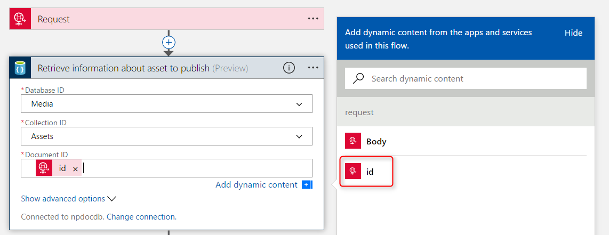

Figure 30: Providing the AssetD to retrieve the correct document

This step will retrieve the JSON document from the DocumentDB instance.

### Task 2: Re-encode the asset using a multi-bitrate preset

1.  The next steps are to recreate the initial workflow but with the
    multibitrate encoding, and without the generation and the translation of the
    subtitles (they already exist as assets). This exercise is primarily used to
    familiarize yourself with the different Azure Media Services functions, but
    also with the manipulation of the different fields in the Code view of the
    Logic App.

    At the end of this step, you should have the following workflow (Figure 28):

    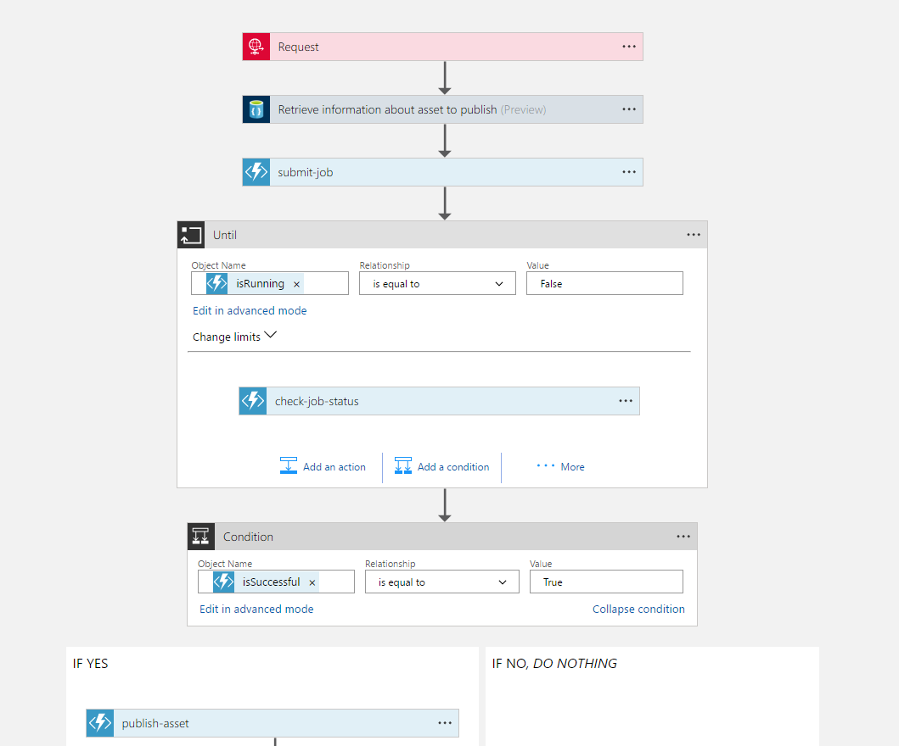

Figure 31: Implementation of the multi-bitrate encoding workflow

1.  Right after the “publish-asset” step, we want to update the DocumentDB
    document to reflect the ID of the multibitrate asset, and also update the
    status to “published”. To do so, we need to retrieve all fields from the
    existing DocumentDB record. Thankfully, Logic App provides a JSON connector
    that allows to parse the JSON structure and therefore access each field
    (Figure 29).

    As a next action, add a “Parse JSON” connector and provide the schema used
    to write the document (Figure 30).

    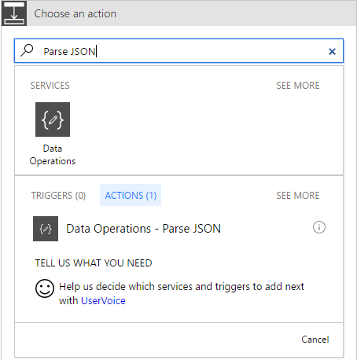

Figure 32: Parse JSON connector in Logic Apps

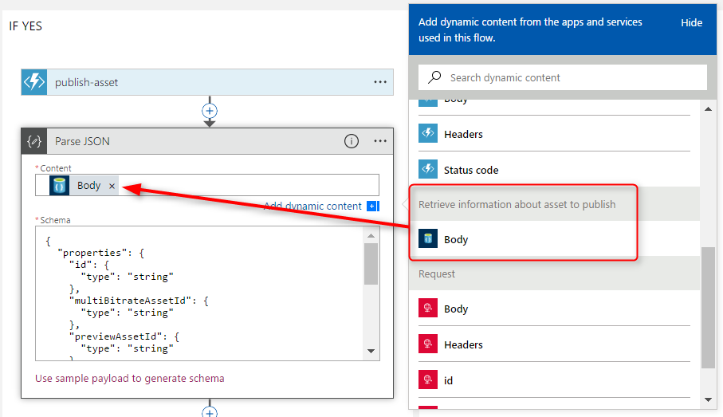

Figure 33: selecting the JSON document from DocumentDB

Add then a new action on DocumentDB to update the document. You will then use
the results of the “Parse JSON” step to populate your updated document (Figure
31).

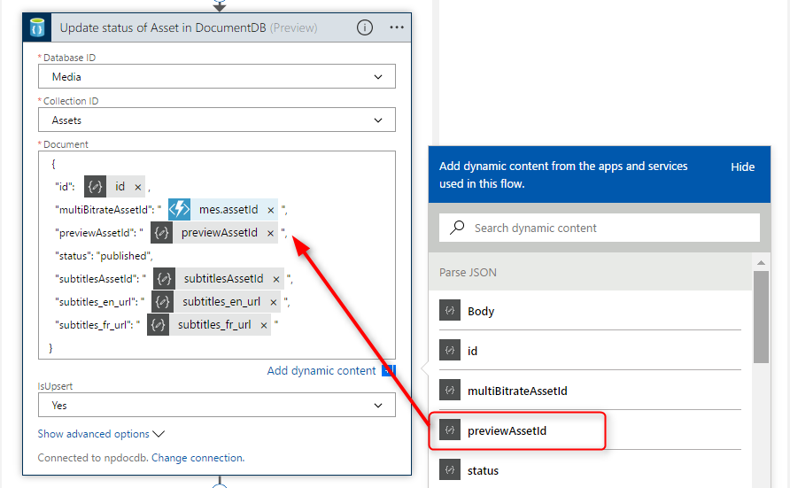

Figure 34: selecting the fields from the "Parse JSON" step

1.  You can finish this exercise by generating a new e-mail with the link to the
    new multibitrate asset, and add the previously generated subtitles as well.

    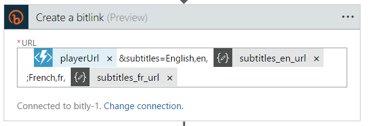

Figure 35: Bitlink to be used in e-mail

1.  Using Postman, you can trigger this new Logic App end-to-end and verify that
    DocumentDB document is indeed updated. You can also check that the playback
    link provides a playback on the new multi-bitrate asset with the same
    subtitles.

### Task 3: Verify the end-to-end approval workflow

In this task, you will configure a local web server application to relay the
moderation request to the Logic App you have just created. This server
application will listen on port 3000 for two types of requests:

-   [http://localhost:3000/approve?assetId=\<your\_asset\_ID](http://localhost:3000/approve?assetId=%3cyour_asset_ID)\>

-   [http://localhost:3000/reject?assetId=\<your\_asset\_ID](http://localhost:3000/reject?assetId=%3cyour_asset_ID)\>

1.  Clone the Github repository <http://github.com/npintaux/media-moderator>.

2.  Clone and install the
    [media-moderator](https://github.com/npintaux/media-moderator) web server
    application (Node.js) to your development machine.

3.  Configure the config.json file with the URL of your “approval” Logic App
    (Task 1).

4.  Run the media-moderator server (node ./media-moderator.js).

5.  Drop a new file in your OneDrive folder and wait for the e-mail. Click on
    “Approve”.

6.  Verify that the “Approve” Logic App is being triggered, and follow each step
    of the new process.

7.  Verify that the asset status is set to “published” in DocumentDB, and verify
    that the playback of the multibitrate asset works correctly.

Exercise 5: Implement the “Reject” workflow
-------------------------------------------

Following the same principles used in Exercise 3, you will now create a new
Logic App to reject the asset. This Logic App will be triggered by an HTTP
request from the media-moderator web server application, and will remove all
assets from storage and delete the record in DocumentDB.

### Task 1: Create a new Logic App as a callable HTTP endpoint

In this task, you will create a new Logic App, and your first trigger will be a
HTTP request. This logic app will later be called by a small web server
application running on your localhost, when the moderator clicks on “Reject” in
the e-mail previously generated.

1.  To facilitate the creation of this Logic App, you can clone the previous.
    This will have the effect of creating a new endpoint (different URL). You
    can then drag and drop the “Parse JSON” step right under the DocumentDB
    retrieval step and delete all the other steps.

You should end up with the Logic App displayed in Figure 33.

### Task 2. Clean-up task

In this task, you will first retrieve all the assetIDs from DocumentDB for the
assetID passed in the request. You will then delete the record in DocumentDB.

1.  You can the use the “delete-entity” function (Figure 34), as shown in and
    build the workflow as displayed in Figure 35.

2.  Verify end-to-end workflow.

3.  Using Azure Media Services Explorer, verify that all assets have been
    correctly deleted.

4.  Verify that DocumentDB no longer contains a document for your assetID.

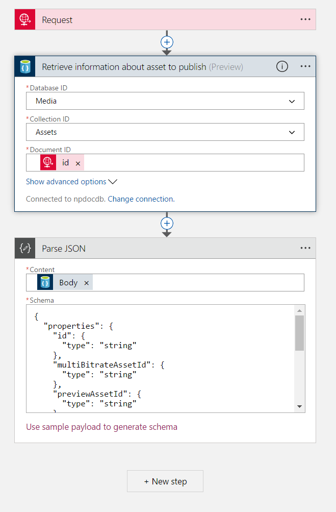

Figure 36: initial "Reject" Logic App

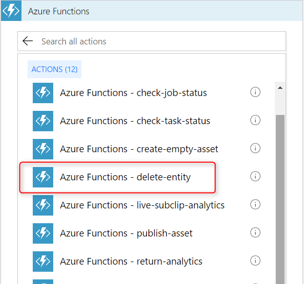

Figure 37: "Delete-entity" function

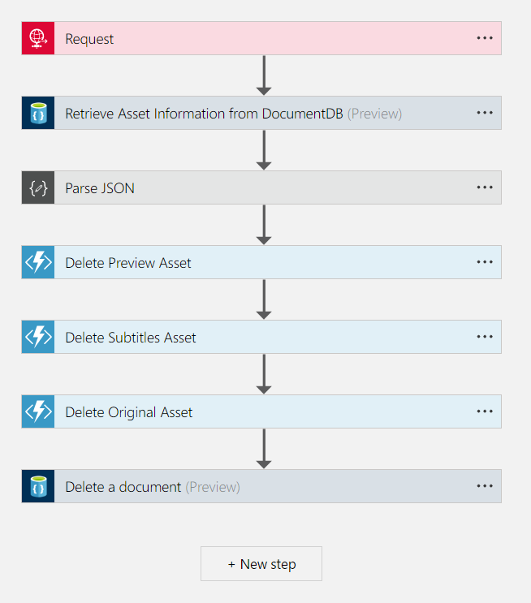

Figure 38: "Reject" final workflow

Exercise 5: Environment Clean-up
--------------------------------

In order to avoid charges, please delete the Resource Group into which you
deployed all your resources.

You can do so very easily by selecting “Resource Groups” in the search bar
results (Figure 36), and then select “Delete” for the specific Resource Group
you want to delete (Figure 37). You will be asked to type the name of the
Resource Group for verification.

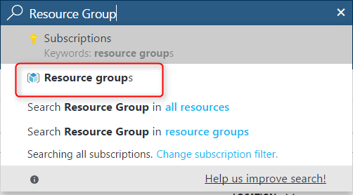

Figure 39: Accessing the list of Resource Groups

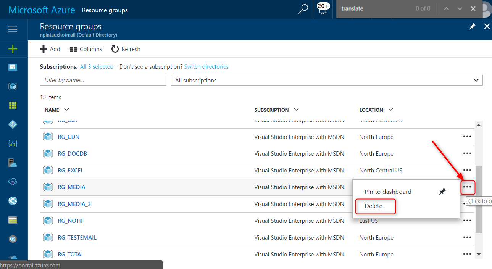

Figure 40: Deleting a Resource Group
